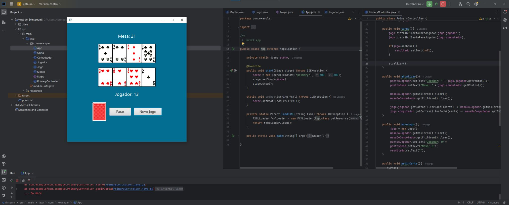

# Projeto-Jogo-21

**Código**: Código rodando.

## Descritivo:

Este projeto feito em Java teve como objetivo, recriar o jogo do 21, muito conhecido dentro dos cassinos.
Apresentando uma tela interativa com o jogo rodando, onde o jogador pode fazer todos os comandos do jogo.
No código criei classes, metódos, trabalhei com herança e override quando foi preciso, Maven e alguns recursos gráficos.
A ideia de usar código limpo sempre se mantém, então os métodos e os IF existem apenas quando necessário.

Durante o desenvolvimento do projeto, fui orientado pelo professor João de Java-Advanced na FIAP.

## Tecnologias:

**Técnicos**: Java, JavaFX, Maven e Recursos Gráficos
